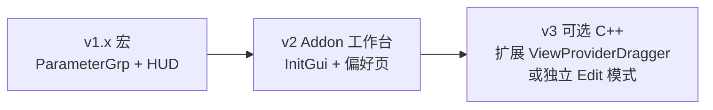

# Interactive Gizmo — Shapr3D 对标开发计划

> 基于 `FreeCAD_Gizmo_前情提要.md` 与 v1.1 实机反馈（手柄可用但偏小、缺实时数值 HUD）整理。  
> 目标：**除吸附外，变换交互全面对标 Shapr3D**；实现路径从宏逐步升级到 Addon / 可选 C++ 集成。

---

## 1. Shapr3D 变换交互功能拆解

| 类别 | Shapr3D 行为 | 用户期望 |
|------|-------------|----------|
| **出现时机** | 选中物体即出现手柄；换选/取消即消失 | v1.1 已做（Auto 模式） |
| **手柄尺寸** | **屏幕上看起来大小基本一致**（缩放视图时手柄不跟着变小） | ❌ 当前偏小，需「显示比例」 |
| **手柄形态** | 三轴平移箭头 + 三轴旋转环；激活轴高亮 | ✅ 复用 `SoTransformDragger` |
| **旋转中心** | 默认在物体几何中心，可改原点 | ✅ 包围盒中心；待扩展选项 |
| **拖拽反馈** | 拖动时**轴旁/附近浮层**显示实时数值（mm/°） | ❌ 待做 |
| **精确输入** | 点击数值可直接键入；支持相对/绝对 | ❌ 待做（对标 HUD 输入） |
| **撤销** | 每次操作一步 Undo | ✅ `openTransaction` |
| **模式** | 移动/旋转可自然切换；部分场景有约束 | 部分（轴自带约束） |
| **吸附** | 面/边/点/网格对齐 | v2（`Draft.Snapper`） |
| **环境** | 手势/笔势友好 | 桌面 FreeCAD + MayaGesture 需不冲突 |

---

## 2. 现状 vs 目标（差距矩阵）

| 功能 | v1.1 宏 | Shapr3D | 优先级 |
|------|---------|---------|--------|
| 命令 / 自动显示 | ✅ | ✅ | — |
| 平移 + 旋转 | ✅ | ✅ | — |
| Placement 写回 + Undo | ✅ | ✅ | — |
| **屏幕恒定尺寸** | ⚠️ 有 `setUpAutoScale` 但比例不可调、相机 API 有警告 | ✅ | **P0 — v1.2** |
| **实时数值 HUD** | ❌ | ✅ | **P0 — v1.3** |
| **HUD 可点击输入** | ❌ | ✅ | **P1 — v1.3** |
| 旋转中心选项 | 仅包围盒中心 | 多种 | P1 — v1.4 |
| 偏好设置页 | ❌ | 内置 | P1 — v1.2/Addon |
| 吸附 | ❌ | ✅ | P2 — v2 |
| Push/Pull | ❌ | ✅ | P3 — 谨慎 |

---

## 3. 架构重新评估

### 3.1 当前方案（Python 宏 + 场景图 Overlay）

```
Selection → GizmoManager → So3DAnnotation → SoTransformDragger
                ↓ drag
           obj.Placement (+ Undo)
```

**优点**：迭代快、不编译 C++、已验证可用。  
**缺点**：与 ViewProvider 编辑链脱节；HUD/偏好/多视图同步需自己维护；`getCameraNode()` 等有弃用警告。

### 3.2 推荐演进路线（三阶段）



| 阶段 | 形态 | 适用 |
|------|------|------|
| **短期** | 增强宏 `InteractiveGizmo.FCMacro` | 显示比例、HUD、设置命令 |
| **中期** | Addon 目录 `Mod/InteractiveGizmo/` | 持久化 Auto 模式、工具栏、完整偏好页 |
| **长期** | Fork 内 C++ 或 PR 上游 | 与 `Std_TransformManip` 同级体验、无场景图 hack |

### 3.3 为何不立刻重写为 C++？

- 用户已能用的宏应**小步增强**，避免重复造 `TaskTransform` + `ViewProviderDragger`（上千行）。
- Shapr3D 体验的关键在 **屏幕比例 + HUD**，宏阶段可实现 80%。
- C++ 适合 v3：统一编辑生命周期、多视图、与 PartDesign 编辑不冲突。

### 3.4 可复用的 FreeCAD 内部件

| 组件 | 路径 | 用途 |
|------|------|------|
| `SoTransformDragger` | `src/Gui/Inventor/Draggers/` | 手柄本体 |
| `ViewParams::DraggerScale` | 默认 `0.03`（NDC） | 参考量级 |
| `GizmoContainer::calculateScaleAndOrientation` | 相机传感器自动缩放 | 照抄逻辑 |
| `TaskTransform` | `src/Gui/TaskTransform.*` | HUD 数值面板参考 |
| `QuantitySpinBox` | `src/Gui/QuantitySpinBox.*` | 带单位输入 |
| `Draft.Snapper` | Draft 工作台 | v2 吸附 |

---

## 4. 分阶段路线图

### v1.2 — 显示比例与屏幕恒定尺寸（**进行中**）

**目标**：肉眼看到的手柄大小一致，且用户可调。

| 任务 | 方法 |
|------|------|
| 偏好项 `DisplayRatio` | `App.ParamGet("User parameter:BaseApp/Preferences/Mod/InteractiveGizmo")` |
| 屏幕恒定模式 | `dragger.draggerSize = ratio` + `setUpAutoScale(camera)`；相机用 `view.getViewer().getSoRenderManager().getCamera()` 优先 |
| 世界绝对模式（可选） | `draggerSize ∝ 物体包围盒对角线 × 系数`，不连 autoScale |
| 设置命令 | `InteractiveGizmo_Settings` 简单对话框 |
| 与全局 DraggerScale 对齐 | 默认 `0.08`（比内置 Transform `0.03` 略大，适合打印模型） |

**验收**：拉远/拉近视图，手柄视觉大小基本不变；设置里调 `1.0 → 2.0` 明显变大。

---

### v1.3 — 实时数值 HUD + 手动输入（对标 Shapr3D 核心差距）

**目标**：拖拽时看到 ΔX/ΔY/ΔZ、ΔRx/ΔRy/ΔRz（或绝对 Placement），可点击输入改值。

**方案 A（推荐先做）— 轻量 Task 面板 + 轴标签**

| 模块 | 实现 |
|------|------|
| 拖拽开始 | `Gui.Control.showDialog(GizmoTaskPanel)` |
| 面板内容 | 6 个 `Gui.Ui` 或 `QuantitySpinBox`：位置 X/Y/Z、旋转 X/Y/Z（欧拉或四元数展示） |
| 拖拽中 | `addMotionCallback` → 更新 spinbox（blockSignals 防循环） |
| 手动输入 | spinbox `valueChanged` → 反算 `Placement` 写回对象 |
| 拖拽结束 | 保持面板或自动关闭（可配置） |

**方案 B（更贴近 Shapr3D）— 3D 视口浮层**

| 模块 | 实现 |
|------|------|
| 浮层 | `So3DAnnotation` + `SoText2` / `SoDatumLabel` 贴在各轴末端 |
| 输入 | Qt `QLineEdit` 作为 view 子控件，`mapToGlobal` 定位到轴屏幕投影 |
| 难度 | 需每帧算轴屏幕坐标；MayaGesture 下要测焦点 |

**建议**：v1.3 先做 **方案 A**（1–2 天量级），v1.3.1 再做方案 B 浮层美化。

**验收**：拖红色箭头时 X 数值实时变；在框内输入 `10mm` 物体跳到对应位置。

---

### v1.4 — 变换原点与模式

| 功能 | 实现 |
|------|------|
| 旋转中心 | 偏好：`BoundingBoxCenter` / `PlacementOrigin` / `CenterOfMass`（复用 `CenterOfMassProvider` 思路） |
| 局部 / 世界坐标 | 读写在 `getGlobalPlacement` 与父级逆变换间切换（参考 `TaskTransform` PositionMode） |
| 仅移动 / 仅旋转 | `SoTransformDragger` 子 dragger 可见性开关（若 API 支持）或换 `SoTranslator` / `SoRotator` 组合 |

---

### v2.0 — 吸附（复用，不重写）

| 任务 | 方法 |
|------|------|
| 拖动中探测 | `Draft.snap` / `Draft.Snapper` 取最近点/面 |
| 阈值贴合 | 距离 < ε 时把 `Placement` 对齐到捕捉结果 |
| 参考 | Assembly Joint 约束 UI；`DraftGui.Snapper` |

---

### v2.1 — 吸附视觉反馈

- 高亮目标面/边（`SoFCSelection` / Draft tracker）
- 预览 ghost 位置

---

### v3 — Push/Pull 等建模向能力（远期）

- 与 PartDesign 特征深度耦合，**单独 Epic**，不与变换手柄混做。

---

## 5. 技术细节备忘

### 5.1 屏幕恒定尺寸原理（FreeCAD 已实现）

`SoTransformDragger::setUpAutoScale` 根据相机与手柄原点算 `worldToScreenScale`，使 `draggerSize` 表示 **NDC 半径**（约 `0.03–0.12`）。  
宏侧必须：

1. 正确拿到 **SoCamera** 节点（避免仅用弃用的 `getCameraNode()`）。
2. 相机变化时触发重算（`GizmoContainer` 用 `SoFieldSensor` 挂 camera height/position）。
3. 暴露 `DisplayRatio` 给用户调节。

### 5.2 HUD 数值应对齐的属性

| 显示 | 来源 |
|------|------|
| 位置 | `obj.Placement.Base`（或 global） |
| 旋转 | `Placement.Rotation` → 欧拉角（与 TaskTransform 一致序列） |
| 增量 | `current - dragStartReference` |

### 5.3 Part Design 注意点

- **Pad** `Placement` 常只读 → 继续 `_resolve_transformable()` 落到 **Body**。
- 移动 Body 后注意 `recompute` 时机（可 `doc.recompute()` 在 `commitTransaction` 后）。

### 5.4 MayaGesture 冲突

- 拖手柄：**左键拖箭头/环**（不用 Alt）。
- 文档写入偏好说明。

---

## 6. 需用户拍板项（醒来可选回复）

| # | 问题 | 建议默认 |
|---|------|----------|
| 1 | HUD 先做侧边 Task 面板还是视口浮层？ | 先 Task 面板 |
| 2 | 数值显示绝对 Placement 还是相对拖拽起点增量？ | 绝对 + 括号显示 Δ |
| 3 | 默认显示比例 | `0.10`（比现网略大） |
| 4 | 是否尽快打包 Addon？ | v1.3 完成后 |

---

## 7. 文件与命令规划

| 版本 | 新增命令 | 文件 |
|------|----------|------|
| v1.2 | `InteractiveGizmo_Settings` | 宏内嵌 + `DisplayRatio` 参数 |
| v1.3 | `InteractiveGizmo` 自动带 Task 面板 | `GizmoTaskPanel.py`（Addon 时拆出） |
| Addon | 工作台 `InteractiveGizmoWorkbench` | `Mod/InteractiveGizmo/InitGui.py` |

---

## 8. Agent 协作规则（摘要）

见 `FreeCAD_Gizmo_前情提要.md` §Agent：能推进则自主推进；仅在本机验收、重大设计拍板时等待用户。

**当前阻塞用户的事项**：v1.2 设置对话框实机试用后反馈默认比例是否合适。
